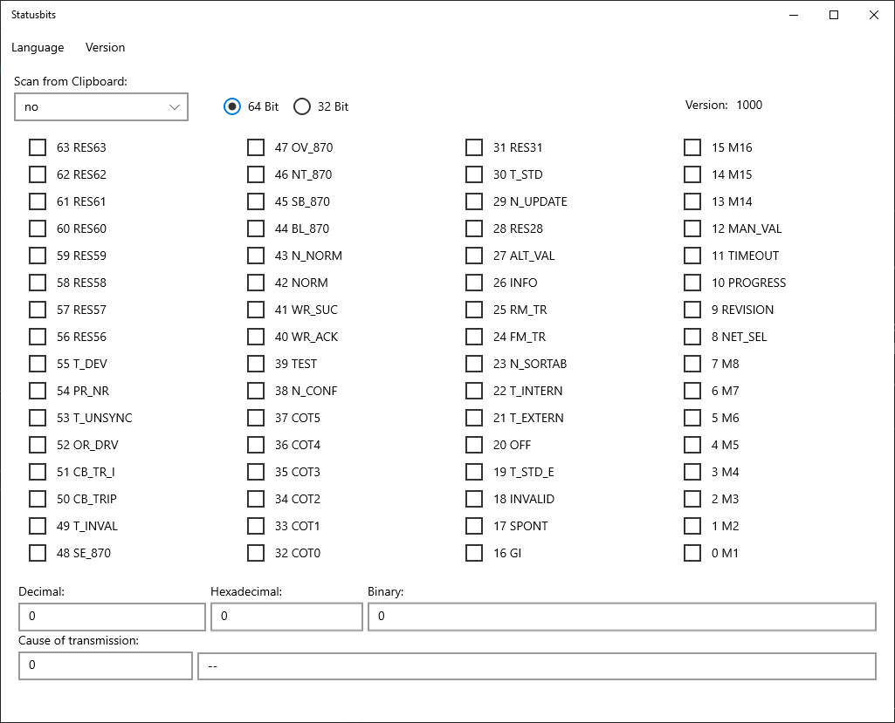

# __Statusbits__

## Table of Contents
1. [About the Project](#About-the-Project)
2. [Funktion](#Funktion)
3. [Aufbau](#Aufbau)
4. [Problem](#Problem)

---

## __About the Project__

 
 

---

## __Funktion__

In dem "Scan From Clipboard" Auswahlfeld kann zwischen den Optionen "no", "hexadecimal", "decimal" und "binary" ausgewählt werden.

Wenn "no" ausgewählt wurde wird keine Eingabe von der Zwischenablage genommen. Bei allen anderen Optionen wird immer wenn die Zwischenablage aktualisiert wird, diese mit dem ausgewählten Zahlensystem kopiert und es werden alle anderen Werte berechnet.

Es können auch die Bits mit Klicks auf die Checkboxen ausgewählt werden. 
Beim Eingeben einer Zahl in die Textboxen werden automatisch alle anderen berechnet.
 

---

## __Aufbau__

Das Programm basiert auf einer Model-View-Presenter (MVP) architektur. "MainPage.xaml.cs" kann dabei als "View" angesehen werden, "StatusbitsController.cs" als "Presenter" und "StatusbitsModel.cs" als "Model".
Die Klasse "BitDecryption.cs" dient als Library um die Werte in alle Zahlensysteme umzurechnen.

__Klassen__
+ StatusbitsController.cs
+ StatusbitsModel.cs
+ BitDecryption.cs
+ MainPage.xaml.cs

*__StatusbitsController.cs__*

Über den Controller werden alle Prozesse gemäß den Eingaben, die vom Benutzer getätigt wurden aufgerufen.

*__StatusbitsModel.cs__*

In der "StatusbitsModel.cs" Klasse werden alle Variablen gespeichert und bereitgestellt.

*__BitDecryption.cs__*

"BitDecryption.cs" wird als Library zum Berechnen von Dezimal-, Hexadezimal-, und Binärzahlen und der ausgewählten Checkboxen verwendet.

*__MainPage.xaml.cs__*

Diese Klasse funktioniert wie eine "View-Klasse" in einem MVP System. Die Klasse wird benutzt um die Eingaben des Benutzers an den Controller weiter zu leiten.

---

## __Problem__

Nach dem Kompilieren lässt sich die "Statusbits.exe"-Datei nicht öffnen. Das liegt vermutlich an Windows, weil ein leeres Projekt auch nicht startet. 

Update: UWP-Apps lassen sich nicht als .exe starten. Sie werden als App im Startmenü hinzugefügt und sind darüber startbar.
Ein weiteres Problem stellt das Clipboard dar. Wenn die App im Hintergrund ausgeführt und die Zwischenablage aktualisiert wird stürzt die App ab. Das Programm muss im Vordergrund laufen.

Weiterführende Links: 
+ <https://stackoverflow.com/questions/51714328/visual-studio-uwp-not-launching-when-clicking-the-executable-from-the-bin-direct>
+ <https://docs.microsoft.com/en-us/windows/uwp/get-started/universal-application-platform-guide#secure> 
